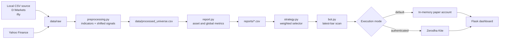
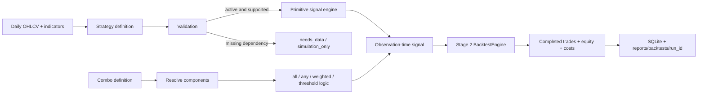

# Algo Trading Terminal — Technical Report

**Project reviewed:** `D:\Git\Algo_trading`  
**Report date:** 23 June 2026  
**Audience:** Project owner, new developers, reviewers, and operators  
**Status:** Updated through Stage 3; code-based technical assessment, not an investment-performance certification

## 1. Executive summary

This project is a local, Python-based algorithmic trading terminal for Indian NSE equities. It brings five activities into one application:

1. Import daily OHLCV market data from a local directory or Yahoo Finance.
2. Calculate technical indicators, preserve 15 legacy signals, and generate config-driven catalog signals.
3. Run either legacy signal-day reports or Stage 2 completed-trade portfolio backtests.
4. Rank the strategies with a weighted score and choose one winner.
5. Scan for that winner's latest buy signals and route orders either to an in-memory paper account or Zerodha Kite.

The web dashboard is the operator interface. Flask supplies account, strategy, report, and order data to a single HTML/JavaScript page.

The project is best understood as a **personal research and paper-trading platform under active construction**. Stage 1 added durable state and safer broker boundaries; Stage 2 added a completed-trade, cash-backed portfolio simulator; Stage 3 added a config-driven strategy and combo research factory. The legacy CSV report remains a signal-day diagnostic and must not be confused with Stage 2 portfolio results. Live broker reconciliation and production controls remain incomplete, so the system is not safe for unattended live trading.

The current stored report would select **RSI_Oversold**, with a selector score of approximately **64.106**. That result comes from a report generated on 17 May 2026. The underlying `data/raw` folder and `data/processed_universe.csv` are absent in the reviewed workspace, so the stored performance cannot presently be regenerated from repository-local data.

## 2. The shortest useful mental model

Think of the project as two connected systems:

- **Research pipeline:** raw CSVs → indicators → signals → consolidated dataset → backtest reports → ranked strategy.
- **Trading pipeline:** ranked strategy → latest signal scan → position sizing → paper or live order → exit sweep → dashboard state.



`main.py` orchestrates both sides and exposes them through HTTP endpoints.

## 3. Repository map

| Path | Responsibility | Reads | Writes / side effects |
|---|---|---|---|
| `main.py` | Startup, Flask application, API routes, shared dashboard state | Reports and module state | Starts local server; triggers pipelines and orders |
| `config_settings.py` | Paths, capital/risk settings, ticker universe, mutable runtime configuration | Local directories | Creates data/report directories; stores runtime credentials in memory |
| `data.py` | CSV synchronization and Yahoo Finance downloads/updates | `D:\Markets\nifty`, Yahoo Finance | `data/raw/*.csv` |
| `preprocessing.py` | Indicators, strategy signals, custom-rule evaluation, consolidation | Raw ticker CSVs | `data/processed_universe.csv` |
| `report.py` | Per-asset and global backtest analytics | Consolidated universe | Two report CSVs |
| `strategy.py` | Normalization, weighted ranking, winner selection | Global strategy report | Console output only |
| `bot.py` | Market-hours logic, paper ledger, Kite connection, orders, exits, daily scan | Raw CSVs, Kite quotes, winning strategy | Paper memory state or real broker orders |
| `templates/index.html` | Complete dashboard UI, styles, charts, API calls | Flask-injected state and JSON APIs | Sends operator commands to Flask |
| `research/reports.ipynb` | Manual inspection of generated reports | Report CSVs | Notebook outputs only |
| `research/testing_ml.ipynb` | Separate experimental XGBoost/Random Forest/LightGBM research | A legacy `final_ml_dataset.csv` path | Notebook models/plots only |
| `requirements.txt` | Runtime dependencies | — | Used by `pip` |

The ML notebook is **not connected to the running application**. It references `D:/Git/algo trading/data_strategies/final_ml_dataset.csv`, a different legacy path and schema.

## 4. End-to-end execution flow

### 4.1 Application startup

Running `main.py` performs the following:

1. Creates `data/raw` and `reports` if necessary.
2. Calls `data.download_all()`, which synchronizes CSVs from `D:\Markets\nifty` into the project without changing the source files.
3. Loads the cached global report if it exists and determines the current winner.
4. If no usable cached report exists, consolidates all local ticker files and regenerates both reports.
5. Starts Flask on `http://127.0.0.1:5000`.

Because startup accepts an existing cached report without comparing its timestamp to raw data, a stale report may remain active after data changes.

### 4.2 Data ingestion

The canonical local source is hard-coded as `D:\Markets\nifty`. Source resolution also checks legacy fallback paths. Synchronization copies files to `data/raw`, skipping existing files unless forced.

For a custom ticker, `yfinance` downloads five years of adjusted daily data. The expected normalized schema is:

| Field | Meaning |
|---|---|
| Index / Date | Trading date |
| Open | Adjusted opening price |
| High | Adjusted daily high |
| Low | Adjusted daily low |
| Close | Adjusted closing price |
| Volume | Daily traded volume |

At least 220 rows are required because the longest indicator is the 200-day EMA and later calculations also need warm-up observations.

### 4.3 Feature engineering

`engineer_technical_indicators()` produces:

- SMA 20 and 50
- EMA 9, 21, 50, and 200
- RSI 14
- MACD, signal, and histogram
- Stochastic %K and %D
- ATR 14
- Bollinger upper, middle, lower, and width
- 20-day volume average and volume z-score

Rows containing indicator warm-up `NaN` values are dropped. Each stock is processed independently and tagged with its ticker before all frames are concatenated.

### 4.4 Signal timing

Each baseline signal is calculated from a day's closing data and then shifted by one row:

```text
condition observed on day t  →  stored actionable signal on day t+1
```

This is an important anti-look-ahead measure. Custom strategy outputs are shifted in the same way. The later backtest applies the shifted signal to day `t+1`'s close-to-close return.

### 4.5 Backtest and report generation

For every strategy and ticker, `report.py` calculates:

```text
market return[t]   = Close[t] / Close[t-1] - 1
strategy return[t] = signal[t] × market return[t]
```

A `+1` signal receives the market return, a `-1` signal receives its inverse, and `0` stays in cash. Combined, long-only, and short-only statistics are computed. Results are then aggregated across assets.

Generated files:

- `reports/asset_performance_leaderboard.csv`: one row per ticker/strategy combination that emitted at least one signal.
- `reports/global_strategy_summary.csv`: one aggregate row per strategy.

Main metrics include compounded return, signal count, win rate, profit factor, average win/loss, win/loss ratio, maximum drawdown, annualized Sharpe ratio, recovery factor, and profitable-asset coverage.

The Sharpe calculation uses 252 trading days and a fixed 6% annual risk-free rate.

### 4.6 Strategy selection

`strategy.py` min-max normalizes each metric across the currently eligible strategies and assigns this score:

```text
Selection Score =
    30% × normalized profit factor
  + 25% × normalized Sharpe ratio
  + 20% × normalized profitable-asset coverage
  + 15% × inverse-normalized absolute drawdown
  + 10% × normalized average return per asset
```

The top score becomes the winner. If selection fails, the system falls back to the first enabled strategy, normally `Volatility_Breakout`.

Important interpretation: min-max scores are **relative to this exact candidate set**. Enabling or disabling one strategy can change every remaining strategy's normalized score even though no performance data changed.

### 4.7 Trading scan and execution

The dashboard scan route evaluates at most the first 60 alphabetically sorted tickers. For every latest signal equal to `+1`, it attempts a buy until ten local positions exist.

Before new entries, the bot marks open positions to market and checks:

- 5% fixed stop loss
- 15% fixed take profit
- 7% trailing stop from the highest observed price

In paper mode, orders use the latest local close plus simulated 0.07% adverse slippage. State exists only in process memory. Restarting the application resets cash, positions, and logs.

In live mode, prices and orders use Kite. The application requests CNC market orders on NSE.

## 5. Strategy catalogue

| Strategy | Signal logic | Direction / behavior |
|---|---|---|
| Volatility Breakout | Close above upper Bollinger band and volume z-score above 1.5 | Sparse long breakout |
| Golden Cross | EMA 50 crosses above EMA 200 | Sparse long regime change |
| EMA Crossover | EMA 9 crosses above EMA 21 | Sparse long momentum |
| RSI Oversold | RSI crosses upward through 30 | Sparse long mean reversion |
| RSI Overbought | RSI crosses downward through 70 | Sparse short mean reversion |
| MACD Histogram Momentum | MACD histogram crosses above zero | Sparse long momentum |
| Bollinger Mean Reversion | Prior close below lower band, current close back above it | Sparse long re-entry |
| Volume Spike | Volume exceeds 2.5 times its 20-day average | Sparse long participation signal |
| Trend Filter | Close above EMA 200 and EMA 9 above EMA 21 | Persistent `+1`; otherwise persistent `-1` |
| Turtle Breakout | Close exceeds the prior 20-day high | Sparse long breakout |
| BB Squeeze Breakout | Prior band width at 20-day minimum and close above upper band | Sparse long volatility release |
| SuperTrend Mimic | Close above prior midpoint plus 3 ATR | Sparse long impulse; not a full SuperTrend algorithm |
| Momentum 20 | 20-day return above +5% or below -5% | Persistent long/short momentum |
| EMA21 Mean Reversion | Standardized deviation from EMA 21 below -2.5 or above +2.5 | Long/short mean reversion |
| Support Bounce | Low near 50-day low and close in upper 35% of daily range | Sparse long reversal |

The live scanner buys only signals equal to `+1`. Negative signals are not used to open short positions. This means the report's combined long/short winner is not necessarily aligned with the executable long-only behavior.

## 6. Custom strategy mechanism

The dashboard can register a mathematical expression against any available dataframe column. Strategy names are sanitized; expressions are parsed into an AST and restricted to selected operators, NumPy helpers, and pandas Series methods. Evaluation occurs with empty Python built-ins.

Example conceptual rule:

```python
(RSI_14 < 35) & (Close > EMA_200) & (Volume > Volume_SMA_20)
```

The rule is validated against one sample asset, added to in-memory configuration, and then applied across the consolidated universe. Custom definitions disappear on restart because they are not persisted. A rule may also validate on the sample but fail on another asset; current processing catches the exception by returning an empty dataframe, which can silently exclude that entire ticker.

## 7. Dashboard and API

| Method | Route | Purpose |
|---|---|---|
| GET | `/` | Render terminal with initial JSON state |
| GET | `/api/state` | Refresh application, account, strategy, and report state |
| GET | `/api/get_reports` | Return global and asset report rows |
| POST | `/api/download_ticker` | Download one ticker and rebuild features/reports |
| POST | `/api/add_custom_strategy` | Validate/register rule and rebuild features/reports |
| POST | `/api/connect_zerodha` | Exchange a Kite request token for a live session |
| POST | `/api/toggle_strategy` | Change in-memory selector eligibility |
| POST | `/api/place_order` | Submit a manual buy/sell |
| POST | `/api/run_scan` | Run exits and scan up to 60 tickers |
| POST | `/api/reset_session` | Clear the in-memory paper account |

The server binds only to loopback by default, which reduces exposure. There is no authentication, authorization, or CSRF protection; changing the host to a network-accessible address would make order-capable endpoints unsafe.

## 8. Configuration and runtime state

Key defaults in `config_settings.py`:

| Setting | Current value |
|---|---:|
| Starting paper capital | ₹1,000,000 |
| Maximum local positions | 10 |
| Intended risk per trade | 1% of current cash |
| Stop loss | 5% |
| Take profit | 15% |
| Trailing stop | 7% |
| Bar interval | Daily |
| Exchange | NSE |
| Dashboard | `127.0.0.1:5000` |

Mutable state—broker credentials, enabled strategies, custom rules, positions, logs, and application status—is process-local and not durable.

The universe is the union of the configured 50-symbol list, filenames in `data/raw`, and filenames in `D:\Markets\nifty`. The comment calls this Nifty 50, but the list should not be treated as a date-versioned official index composition.

## 9. Current stored artifact snapshot

At review time:

- `data/raw` contains **0 CSV files**.
- `data/processed_universe.csv` is absent.
- `reports/global_strategy_summary.csv` exists and was last modified 17 May 2026.
- `reports/asset_performance_leaderboard.csv` exists and was last modified 17 May 2026.
- The global report has 15 strategy rows.
- Applying the current selector formula ranks `RSI_Oversold` first at about 64.106 and `Support_Bounce` second at about 61.759.
- Several stored results have extreme drawdowns: for example Momentum 20 is reported at -89.94% and Trend Filter at -93.94%.

Those results are historical artifacts, not reproducible evidence in the present checkout. The reports also contain very large “trade” counts—for example 441,732 for Trend Filter—because each active asset-day is counted as a trade.

## 10. What the performance numbers really mean

This section is crucial. The report engine is internally consistent, but some labels imply more realism than the calculation provides.

### “Trades” are active signal-days

There is no entry, holding period, exit, or round trip in `report.py`. Every non-zero signal row is counted separately. Persistent strategies therefore generate one “trade” per day per asset. Win rate and profit factor are distributions of active daily returns, not completed-trade statistics.

### No portfolio construction

Per-asset equity streams are calculated independently and then averaged. The backtest does not enforce ₹1,000,000 capital, ten position slots, position sizing, overlapping signals, or cash constraints. Its results cannot be compared directly with the paper account's portfolio value.

### No realistic execution model

The report has no commissions, STT, exchange fees, GST, stamp duty, bid/ask spread, liquidity filter, market impact, or order rejection. Signals derived from the previous close receive the next close-to-close return, which assumes exposure over that interval without explicitly specifying or pricing the entry.

### Potential survivorship and data-quality bias

The universe is based on current configuration and available files. There is no historical index membership model, delisting treatment, corporate-action audit, or validation of missing dates and zero/abnormal values.

### In-sample strategy selection

The same full history is used to measure and choose the winner. There is no train/validation/test split, walk-forward selection, parameter stability analysis, or multiple-testing correction. The winner is therefore a research hypothesis, not demonstrated out-of-sample alpha.

## 11. Risk register and known defects

### Critical before live use

1. **Live positions are not recorded locally.** A successful Kite order returns immediately without updating `positions` or cash. Exit sweeps and the ten-position limit therefore do not reflect the broker account.
2. **Live order failure silently falls through to paper execution.** An operator can receive a paper fill after a rejected live order, producing a dangerous mismatch between dashboard and broker reality.
3. **No broker reconciliation.** Orders, fills, holdings, open orders, partial fills, rejections, and externally created positions are never synchronized from Kite.
4. **Manual live orders bypass the market-hours guard.** The guard is applied in `run_daily_pipeline()`, not in `execute_order()`.
5. **The application has no durable or idempotent order state.** A restart loses local context and repeated scans can buy the same ticker again.

### High priority correctness issues

1. **ATR sizing uses the wrong column name.** The scanner requests `ATR`; preprocessing creates `ATR_14`. Position sizing therefore always takes the equal-weight fallback.
2. **Backtest and execution semantics differ.** Reports evaluate negative signals and daily persistence; the live scanner only opens long positions on `+1` and uses separate stop/target exits.
3. **Scan universe is silently capped at 60.** The dashboard passes only the first 60 sorted symbols, while reports may cover a much larger universe.
4. **Cached report freshness is not validated.** Existing reports are used even if source data is newer or absent.
5. **Selector fallback can re-enable disabled intent.** If filtering leaves no rows, scoring falls back to the unfiltered summary.
6. **Only local positions enforce capacity.** The scanner can add to an existing ticker repeatedly; position count remains unchanged.

### Dashboard defects

1. `resetSession()` calls `/api/run_scan` instead of `/api/reset_session`, so the Reset button can place orders rather than reset state.
2. `runExitSweep()` also calls the full scan endpoint, so it may create entries in addition to exits.
3. `runRecalibration()` does not invoke a recalibration endpoint; it normally only performs a state GET.
4. The recalibration ticker expression has JavaScript operator-precedence behavior that discards a typed ticker in common states.
5. The strategy leaderboard expects `Selection_Score` in the saved CSV, but that column is only added in memory by `score_strategies()`. Score bars can therefore display zero/blank.
6. The displayed maximum position count is hard-coded to 10 rather than supplied by configuration.

### Engineering and operational gaps

- No automated tests or CI configuration.
- No README, environment example, lockfile, or declared Python version.
- No structured persistent logs, database, health checks, alerts, or scheduler integration despite APScheduler being listed.
- Broad exception handling often converts data errors into empty frames, which can hide partial-universe failures.
- Data and configuration are Windows-path dependent.
- The source contains mojibake characters (`→`, `₹`, etc.), indicating an encoding mismatch that may affect UI readability.
- Flask endpoints run long recalibrations synchronously, tying up request threads.
- The global lock protects recalibration but not account/order mutations.
- Credentials are accepted through the browser and held in process memory; secrets are not masked at input/storage boundaries beyond display masking of the API key.

## 12. Recommended improvement roadmap

### Phase 1 — Make paper behavior trustworthy

1. Fix the three incorrect UI endpoint actions and add a dedicated recalibration route.
2. Change `ATR` to `ATR_14`; cap quantity by cash, slot exposure, and instrument constraints.
3. Build automated tests for indicator timing, each strategy, selector scoring, position exits, API routes, and reset behavior.
4. Persist configuration and paper state in SQLite; make scans and order requests idempotent.
5. Add data validation, freshness checks, and a pipeline manifest containing source dates, row counts, skipped tickers, code version, and report generation time.

### Phase 2 — Build a decision-grade backtest

1. Define explicit next-open or next-close execution and match it in live scanning.
2. Model position entry/exit, holding periods, capital, maximum positions, sizing, fees, spread, and slippage.
3. Compare the executable long-only strategy, not combined long/short metrics, unless short execution is implemented.
4. Add benchmark returns, exposure, turnover, CAGR, Calmar/Sortino ratios, confidence intervals, and per-period stability.
5. Use walk-forward testing with a final untouched out-of-sample interval.

### Phase 3 — Introduce a safe live broker adapter

1. Separate `PaperBroker` and `KiteBroker` behind one interface; never fall through between them after an order attempt.
2. Reconcile broker orders, trades, holdings, positions, and funds before and after every decision cycle.
3. Track order lifecycle states and partial fills with durable IDs.
4. Add kill switch, daily loss limit, per-symbol exposure, duplicate-order prevention, holiday calendar, and explicit operator confirmation for enabling live mode.
5. Make live mode fail closed when quotes, broker state, or data are unavailable.

### Phase 4 — Production operations

Add authentication, CSRF protection, secret management, migrations, structured logging, monitoring, alerting, backups, dependency pinning, CI, and a controlled deployment process. Keep the dashboard loopback-only until those controls exist.

## 13. Installation and operation

The repository expects Python packages listed in `requirements.txt`. A typical PowerShell setup is:

```powershell
py -m venv .venv
.\.venv\Scripts\Activate.ps1
python -m pip install --upgrade pip
python -m pip install -r requirements.txt
python main.py
```

Then open `http://127.0.0.1:5000`.

Before starting, either:

- place valid OHLCV CSV files in `D:\Markets\nifty`, or
- change `RAW_DATA_DIR` in `config_settings.py` to the actual source location, or
- use the custom ticker download after the server starts.

Useful component commands once Python is installed:

```powershell
python data.py             # synchronize and incrementally update local data
python preprocessing.py    # rebuild processed_universe.csv
python report.py           # rebuild both performance reports
python strategy.py         # print rankings and selected winner
python bot.py              # initialize broker/paper mode and run a limited scan
```

`bot.py` can place real orders if authentication succeeds. Use it only after the live-safety gaps in this report are addressed.

## 14. Suggested verification checklist

For each research run, record and verify:

- raw data source, earliest/latest date, ticker count, and skipped symbols;
- duplicate dates, missing OHLCV values, non-positive prices, and negative volume;
- signal on day `t` uses no information newer than the chosen execution time;
- report configuration and code commit are captured;
- results include realistic transaction costs and portfolio constraints;
- an untouched out-of-sample period remains;
- the chosen live signal and exit rules exactly match the tested rules.

For each live session, verify broker mode visibly, reconcile broker state, confirm available funds and holdings, set loss/exposure limits, test the kill switch, and require explicit confirmation before order routing is enabled.

## 15. Dependency notes

| Package | Role |
|---|---|
| pandas / NumPy | Dataframes, calculations, aggregation |
| `ta` | Technical indicators |
| yfinance | Custom downloads and incremental EOD updates |
| Flask | Local dashboard and JSON API |
| pytz | IST market-hours calculation |
| kiteconnect | Zerodha authentication, quotes, and orders |
| APScheduler | Listed but not used by current source |

The ML notebook additionally imports packages not declared in `requirements.txt`, including scikit-learn, XGBoost, LightGBM, Matplotlib, and Seaborn.

## 16. Glossary

- **OHLCV:** Open, high, low, close, and volume market data.
- **Signal:** A numeric instruction: `+1` long, `-1` short, `0` inactive.
- **ATR:** Average True Range, a volatility measure.
- **Drawdown:** Decline from a previous equity peak.
- **Profit factor:** Gross winning return divided by absolute gross losing return.
- **Sharpe ratio:** Excess return divided by return volatility, annualized here.
- **Slippage:** Difference between the observed/reference price and assumed fill price.
- **Walk-forward test:** Repeatedly train/select on past data and test only on later unseen data.
- **Reconciliation:** Matching local orders and positions to the broker's authoritative records.

## 17. Final assessment

This was the assessment of the original prototype. Stage 1 subsequently fixed the destructive dashboard actions, added durable paper state, and isolated broker boundaries. Stage 2 created a separate completed-trade engine so new research no longer depends on the legacy signal-day report. Stage 3 now separates strategy configuration from execution simulation.

The remaining operational gap is still live broker reconciliation; live trading therefore remains disabled. The remaining research gap is governance across a very large hypothesis library: data versioning, false-discovery control, redundancy analysis, and nested out-of-sample evaluation are now more important than adding additional rules.

## 18. Stage 1–3 architecture update

The original assessment above remains useful for understanding the legacy modules and why they were refactored. The current application now has three explicit layers of capability:

| Stage | Purpose | Authoritative components |
|---|---|---|
| Stage 1 | Persistence, paper safety, registry skeleton, API/UI foundation | `app/db`, `app/brokers`, `app/risk`, Stage 1 services/routes |
| Stage 2 | Completed-trade portfolio research | `app/backtesting`, `BacktestService`, backtest API and Backtesting Lab |
| Stage 3 | Large config-driven strategy and combo research library | `app/strategies`, strategy/combo services, APIs, Library and Combo Builder |

Live trading remains disabled by default. Stage 2 and Stage 3 are research facilities; neither activates Zerodha execution.

### 18.1 Current research flow



The central safety rule is that Stage 3 generates signals but does not simulate execution itself. Every runnable base strategy and combo passes its signal column into the same Stage 2 engine.

### 18.2 Strategy catalogue

The catalog contains the 230 named base research candidates requested for investing/factor, trend, momentum, mean-reversion, breakout, pullback, volume, volatility, price-action, and gap research. Three options research definitions are additionally registered as simulation-only, producing more than 230 total definitions.

Definitions are not made active merely to satisfy the count. The catalog builder assigns one of these statuses:

| Status | Meaning |
|---|---|
| `active` | Current daily data and audited primitives can generate the configured signal |
| `disabled` | Definition or validation is invalid or intentionally unavailable |
| `needs_data` | Fundamentals, sector context, constituents, pivots, profiles, or another missing dataset is required |
| `needs_intraday_data` | Rule depends on VWAP, opening range, or intraday timing |
| `simulation_only` | Registered for learning/simulation but cannot route to execution |

Each `CatalogStrategy` stores:

- stable ID, name, category/subcategory, direction, timeframe, and asset class;
- status, description, learning note, tags, and unsupported reason;
- required/optional columns and parameters;
- config-driven entry, filters, default exits, and risk plan;
- explanation template and enabled state.

Category modules live under `app/strategies/builtin/`. Legacy 15-strategy metadata is retained separately in `legacy_builtin.py` for compatibility.

### 18.3 Primitive signal engine

`app/strategies/primitives/conditions.py` supplies reusable rules rather than one Python function per strategy. Implemented families include:

- comparisons and ranges;
- crossover/crossunder and level crosses;
- moving-average position, slope, and alignment;
- higher/lower price structure;
- ROC, RSI, and MACD conditions;
- ATR percentiles, Bollinger compression/expansion, and volatility contraction;
- relative volume and volume z-score;
- inside/outside bars, engulfing candles, hammer, shooting star, doji, and range patterns;
- prior/rolling weekly/monthly high-low breaks;
- support bounce, resistance rejection, and moving-average pullback;
- recursive `all`, `any`, `not`, weighted vote, score threshold, and minimum-confirmation logic.

Dynamic SMA, EMA, ROC, rolling-high/low, gap, range, body, and price-z-score series are derived using current and historical rows only. Primitives that require unavailable data, such as OBV, MFI, or cross-sectional ranks, raise explicit dependency errors instead of returning false signals.

### 18.4 Combo strategy system

The combo registry contains the 120 requested names across trend/momentum, breakout, pullback, mean-reversion, volume/volatility, and factor/portfolio research. A deliberately limited audited subset is active; remaining definitions retain `needs_data` status until their exact component logic and datasets are implemented.

A combo contains:

- component type (`primitive`, `base_strategy`, or contextual filter);
- component reference, arguments, weight, and required flag;
- logic mode and threshold;
- direction, exit rules, risk settings, tags, and status.

Supported logic modes are `all`, `any`, `weighted_vote`, `min_confirmations`, and `score_threshold`. The combo engine evaluates component signals per symbol and creates one observation-time combo signal for Stage 2.

### 18.5 Stage 2 backtesting semantics

The decision-grade engine is separate from legacy `report.py`. It models:

- next-open, next-close, or explicitly research-only same-close execution;
- cash-secured positions with no leverage;
- maximum positions, duplicate prevention, integer sizing, and liquidity checks;
- fixed quantity/value, equal weight, risk-percent, and ATR-risk sizing;
- stop loss, target, trailing stop, maximum holding, opposite signal, and final forced exit;
- adverse slippage, spread, configurable Indian-market fee approximations, and cost breakdown;
- completed trades, rejected orders, daily summaries, equity/drawdown, benchmark comparison, and exports;
- robustness scenarios and simple fixed-parameter walk-forward folds.

Legacy persisted signals are shifted back to their observation row before Stage 2 applies its explicit execution delay. Config-driven Stage 3 signals are already observation-time signals and are not shifted again.

### 18.6 Database additions

Migration 2 adds completed-backtest tables:

- `backtest_runs`
- `backtest_trades`
- `backtest_orders`
- `backtest_equity_curve`
- `backtest_daily_summary`
- `backtest_metric_breakdown`

Migration 3 adds strategy-factory tables:

- `strategy_definitions`
- `strategy_validation_results`
- `combo_strategy_definitions`
- `strategy_signal_explanations`
- `strategy_categories`

Migrations are additive and run through `Database.initialize()`. Existing Stage 1 paper records and Stage 2 runs are not deleted.

### 18.7 Stage 3 APIs

| Route group | Purpose |
|---|---|
| `/api/strategy-library` | Search/list definitions and retrieve full details |
| `/api/strategy-library/<id>/toggle` | Persist supported strategy enabled state |
| `/api/strategy-library/<id>/validate` | Check primitives, data, timeframe, and direction |
| `/api/strategy-library/<id>/backtest` | Generate signal and invoke Stage 2 |
| `/api/combo-strategies` | List and create persisted combos |
| `/api/combo-strategies/<id>` | Retrieve or update combo configuration |
| `/api/combo-strategies/<id>/validate` | Validate components and logic |
| `/api/combo-strategies/<id>/backtest` | Generate combo signal and invoke Stage 2 |
| `/api/combo-strategies/<id>/duplicate` | Clone a combo under a new ID |
| `/api/combo-strategies/<id>/toggle` | Persist enabled state |
| `/api/strategy-categories` | Category metadata and counts |
| `/api/strategy-primitives` | Primitive inventory for the builder |

### 18.8 User interface

The terminal now includes:

- **Library:** search, category/direction/status filters, category counts, card/table views, requirements, parameters/config, explanation example, validation, enable/disable, and a Stage 2 shortcut.
- **Combo builder:** primitive/base selection, JSON arguments, weights, logic/threshold, direction, stops/targets/trailing settings, live config preview, save, validate, duplicate, enable/disable, and backtest shortcut.
- **Backtests:** launcher, persisted history, completed trades, metric health, warnings, robustness scenarios, and strategy/benchmark equity chart.

### 18.9 Important research limitations

1. A large catalog creates severe multiple-testing and false-discovery risk. Testing hundreds of variants and selecting the best historical curve is not valid evidence of future performance.
2. `needs_data` definitions are metadata only until their required dataset and audited mapping exist.
3. Sector, market-regime, portfolio, factor, and cross-sectional strategies need synchronized contextual data beyond per-symbol OHLCV.
4. Intraday rules cannot be inferred honestly from daily candles.
5. Options definitions are simulation-only without historical chains, volatility surfaces, contract metadata, liquidity, and expiry handling.
6. Combo contextual filters remain unavailable until benchmark and sector series are aligned with each asset timeline.
7. Stage 2 has conservative but simplified daily-bar assumptions; unknown intrabar path, market impact, partial fills, and corporate actions remain limitations.
8. No catalog entry or combo should be described as profitable without properly controlled out-of-sample evidence—and even then, historical evidence is not a guarantee.

### 18.10 Updated assessment

The project has progressed from a monolithic signal dashboard into a layered research platform: durable state and broker safety in Stage 1, portfolio simulation in Stage 2, and a configurable strategy factory in Stage 3. The strongest architectural improvement is the separation between signal definition and execution simulation.

The next priority should not be adding more strategies. It should be experiment governance: dataset/version manifests, historical-universe membership, correlation and redundancy analysis, false-discovery controls, nested walk-forward evaluation, and reproducible comparisons. Live execution should remain disabled.

### 18.11 Verification status

The repository includes 51 named Stage 3 pytest functions in addition to 14 Stage 1 and 30 Stage 2 test functions. They cover catalog sizes, metadata, uniqueness, validation statuses, primitives and logic operators, synthetic base/combo signals, explanation content, API behavior, Stage 2 routing, SQLite persistence, disabled-state handling, export completeness, and safety-route behavior.

Runtime verification now uses the project venv at `C:\Users\nisha\AI_ML_PROJECTS\algo_project\algo_env\Scripts\python.exe`. Before Stage 4, 95 tests passed and runtime imports returned 233 base definitions and 120 combos.

## Stage 3 Completion and Verification

**Verification time:** 2026-06-23 18:31:53 +05:30
**Final status:** PASS

### Environment and commands

> Historical note: the unavailable-Python rows below describe the earlier sandbox audit and are superseded by the verified project-venv results in the Environment and Virtual Environment Status section.

| Check | Result |
|---|---|
| `python --version` | FAIL — PowerShell reports that `python` is not recognized. |
| `py -0p` | FAIL — Windows launcher reports “No Installed Pythons Found”. |
| `python -m pip list` | FAIL before execution — Python unavailable. |
| `python -m pytest -q` | NOT RUN — Python unavailable. |
| `python -m pytest tests -q` | NOT RUN — Python unavailable. |
| Base catalog import/count command | NOT RUN — Python unavailable. |
| Combo catalog import/count command | NOT RUN — Python unavailable. |
| `python main.py` | NOT RUN — Python unavailable. |
| Optional `scripts/init_db.py`, `scripts/run_tests.py`, `scripts/health_check.py` | NOT FOUND in this repository; database initialization is automatic through `Database.initialize()`. |
| `git diff --check` | PASS; line-ending warnings only, no whitespace errors. |

### Acceptance evidence

| Item | Result |
|---|---|
| App startup | PASS before Stage 4: Flask served `/` with HTTP 200 using the project venv. |
| UI smoke test | Core dashboard startup passed before Stage 4; final Stage 4 visual interaction remains a manual check. |
| Base strategy count | 233 by runtime import. |
| Combo strategy count | 120 by runtime import. |
| Active strategy count | 95 by source-generated classification and initialized catalog validation. |
| Needs-data strategy count | 130 by source-generated classification and initialized catalog validation. |
| Needs-intraday strategy count | 5 by source-generated classification and initialized catalog validation. |
| Simulation-only strategy count | 3 by source-generated classification and initialized catalog validation. |
| Disabled strategy count | 0 generated definitions; invalid runtime/custom definitions can still be disabled. |
| Active combo count | 12 by catalog mapping and initialized registry. |
| Needs-data combo count | 108 by catalog mapping and initialized registry. |
| Invalid combo count | 0 generated definitions; invalid custom payloads are rejected. |
| Stage 2 integration | Static PASS: base/combo routes feed `BacktestConfig` to the existing `BacktestService`; runtime integration remains unverified. |
| Migration status | Static PASS: migrations 1–3 are additive and use `CREATE TABLE IF NOT EXISTS`; runtime application remains unverified. |
| API verification | Static PASS for all 15 required Stage 3 route declarations; runtime Flask responses remain unverified. |
| Test inventory | Stage 1–3 runtime suite: 95 passed before Stage 4. |

Updated runtime override: Stage 2 integration, migrations, and the Stage 3 APIs all pass the project-venv test suite. The older “static PASS / runtime unverified” wording above is retained only as historical audit provenance.

### Bugs found and fixed

1. Required named primitives were absent. Added MACD-histogram, relative-strength, volume, optional OBV/MFI, NR7/wide-range, and pullback primitives with deterministic causal implementations or clear missing-column failures.
2. Acceptance count commands referenced loader functions that did not exist. Added `load_base_strategy_catalog()` and `load_combo_strategy_catalog()`.
3. Strategy/combo explanations lacked symbol, date, passed filters, freshness, and complete risk context. Added those fields.
4. Primitive argument counts and obvious future references were not validated. Added signature binding and simple future-use detection.
5. A caller-supplied duplicate combo ID could overwrite an existing definition. POST/create now rejects it while PUT/update remains explicit.
6. Stage 3 had only 36 documented tests. It now contains 50 named tests, including the missing API, metadata, explanation, duplicate-ID, visibility, loader, and full primitive-contract checks.
7. Combo Builder had no dedicated stylesheet. Added one and linked it in the document head.
8. Shared Stage 1 API responses omitted mandatory `warnings` or `details`. Standardized the envelope while retaining UI compatibility aliases.
9. Reset, exit-only sweep, recalibration, and report-export wiring lacked behavioral tests. Added targeted tests.
10. Combo `not` logic was missing from the engine, validator, and UI. Added a single-component negation contract and regression test.
11. All-winning samples used gross currency profit as a profit-factor ratio. Profit factor is now explicitly undefined when there are wins but no losses, with safe robustness and UI handling.

### Remaining issues

- Continue manual visual checks for dashboard workspaces and browser-console errors after material UI changes.

### Stage 1–3 completion matrix

| Stage | Area | Status | Evidence | Remaining Work |
|---|---|---|---|---|
| Stage 1 | Foundation/Persistence/Safety/UI | PASS | Runtime suite and pre-Stage-4 HTTP 200 startup verification. | Continue manual operational checks before any live work. |
| Stage 2 | Backtesting Engine | PASS | Completed-trade tests, persistence, costs, execution, reports, and API coverage passed. | Retain model limitations and out-of-sample controls. |
| Stage 3 | Strategy Library/Combos | PASS | Runtime counts 233/120 and full Stage 1–3 suite passed. | Unsupported-data definitions remain intentionally unavailable. |

**Stage 1–3 were stable enough to proceed to Stage 4.**

## Environment and Virtual Environment Status

**Project venv:** `C:\Users\nisha\AI_ML_PROJECTS\algo_project\algo_env`

**Exact interpreter:** `C:\Users\nisha\AI_ML_PROJECTS\algo_project\algo_env\Scripts\python.exe`
**Python:** 3.10.11

The venv is functional when executed outside the restricted filesystem sandbox. The apparent missing-base-Python error inside the sandbox was a visibility artifact; the exact interpreter printed the expected path and version when run with the required host access.

Pre-Stage-4 verification:

- Full suite: `95 passed, 72 warnings`.
- Base catalog runtime count: 233.
- Combo catalog runtime count: 120.
- Flask startup before Stage 4: `/` returned HTTP 200.

Stage 4 introduced no third-party dependency. It uses `urllib` and SQLite from the Python standard library. `requirements.txt` documents the mandatory venv installation command. Dependency verification was requested with the exact interpreter; the execution harness did not return a final pip transcript, but the complete pytest run imported all Stage 4 modules successfully.

## Stage 4 — LLM Assistant, RAG, App Search, and Personal Agent

### Architecture

Stage 4 adds six cooperating layers without changing the rule-based trading engine:

1. `app/llm`: LM Studio OpenAI-compatible client, model configuration, errors, and strict system prompt.
2. `app/rag` and `app/search`: Markdown/SQLite indexing, chunking, deterministic retrieval, and structured app search.
3. `app/assistant`: intent routing, guardrails, controlled tools, persisted drafts, and explicit approval execution.
4. `app/profile`: one durable local trading profile with risk/default preferences and secret rejection.
5. `app/dashboard_builder`: saved layouts and allowlisted widgets.
6. Stage 4 services/routes/UI integrated into the existing Flask terminal.

The assistant is not a trading engine. Strategies remain rule-based, Stage 2 remains the evidence engine, the risk manager remains the gatekeeper, and the user remains the only approval authority.

### LM Studio configuration and offline behavior

Defaults are provider `lmstudio`, base URL `http://localhost:1234/v1`, and model `qwen3.5-9b` (Qwen3.5 9B Q4_K_M). Configuration uses `LLM_*` and `RAG_*` environment variables. Status checks use a bounded timeout. If LM Studio is disabled or offline, Flask, profiles, dashboards, RAG, app search, and deterministic tools continue working; chat returns an explicit offline message rather than crashing.

### RAG and app-search sources

The indexer reads README, technical report, changelog, optional `docs/*.md`, strategies, combos, backtest runs/trades/metrics, paper account/orders/positions/trades, risk events, system logs, conversations, profiles, dashboards, and widgets. Documents are content-hashed, chunked, timestamped, and stored locally. Retrieval uses transparent token matching plus source-type relevance; no embeddings or vector database are involved.

### Controlled tools and approval workflow

The registry distinguishes read-only, draft-only, and approval-required tools. Forbidden tools—live orders, live enablement, risk bypass, credential modification, arbitrary execution, database deletion, and self-approval—are not callable.

```text
request → persisted draft → deterministic validation/risk context
→ visible preview → explicit user approve/reject → whitelisted handler → audited result
```

Profile changes, dashboard changes, strategy/combo changes, backtests, paper orders, resets, and trade annotations cannot execute directly from chat. Approved paper orders still use `PaperTradingService` and its risk manager. Live mode is rejected.

### Trading profile, dashboards, and trade history

The profile stores market/timeframe preferences, capital/risk limits, favorites, watchlists, learning level, and backtest defaults; broker secrets are forbidden. Dashboard layouts persist allowlisted research, paper, and risk widgets. Trade history unifies paper and backtest trades and supports approved notes/tags; a richer behavioral journal remains future work.

### Database additions

Migrations 4–6 add conversations, messages, action drafts, RAG documents/chunks, app-search records, trading profile, dashboard layouts/widgets, trade annotations, watchlists, and saved screeners. Migrations are additive and preserve Stage 1–3 data.

### API and UI summary

Stage 4 adds assistant status/chat/conversation/draft approval routes; RAG reindex/status/search; global app search; profile draft/update; dashboard layout/widget draft routes; and unified trade-history routes. The integrated terminal adds Assistant, Search, Profile, and Custom Dashboard workspaces with offline status, context chips, draft previews, approve/reject controls, search filters, profile risk fields, and widget grids.

The app-search service performs a deterministic initial reindex when its local index is empty. Search APIs therefore work on first use and do not depend on a prior RAG test or manual reindex action.

### Safety restrictions

- No ML/DL prediction model was added.
- No arbitrary Python or shell tool exists.
- No live-order or live-enablement tool exists.
- Assistant actions cannot bypass strategy validation, Stage 2, risk checks, or approval.
- The assistant refuses unsafe instructions and never promises profit.
- Live trading remains disabled by default.

### Test and verification result

- Dedicated Stage 4 suite: `44 passed`.
- Full Stage 1–4 suite: `139 passed` with no warnings after the resampling fix.
- Migrations smoke test: schema versions 1–4 loaded before migration 5 was added; migration 5 is covered by the final suite requirement.
- Flask composition smoke test: 71 routes loaded before the final route-neutral hardening changes.
- A source-aware RAG ranking defect was found and fixed during testing.
- Startup data maintenance was moved off the Flask bind path after a slow synchronization blocked the HTTP probe.

### Known limitations and final status

LM Studio generated chat requires a separately running local server. Retrieval is keyword-based rather than semantic embeddings. Search must be reindexed after major state changes. The current deployment is local and has no multi-user authentication boundary. A post-change subprocess test verified that `main.py` served HTTP 200 using the project interpreter. Visual interaction and browser-console inspection remain manual because the in-app browser control surface was unavailable.

**Stage 4 status: PASS — automated safety, persistence, API, HTML composition, offline behavior, and real HTTP startup checks pass.**

| Stage | Area | Status | Evidence | Remaining Work |
|---|---|---|---|---|
| Stage 1 | Foundation/Persistence/UI | PASS | Verified in the 95-test baseline and 139-test combined suite. | Keep live mode disabled. |
| Stage 2 | Completed-trade backtesting | PASS | Lifecycle, cost, persistence, report, and API tests pass. | Preserve research limitations. |
| Stage 3 | Strategy Library/Combos | PASS | Runtime counts 233/120 and integration tests pass. | Supply missing external datasets only when audited. |
| Stage 4 | Assistant/RAG/Search/Profile/Dashboards | PASS | 44 dedicated tests, 139 combined tests, and real HTTP startup passed. | Keep LM Studio and live trading as separate, disabled-by-default boundaries. |

**Stage 1–4 are stable enough to proceed to Stage 5.**

## Stage 5 — Paper Trading and Portfolio Operations Terminal

### Environment and verification

Stage 5 was implemented and tested with `C:\Users\nisha\AI_ML_PROJECTS\algo_project\algo_env\Scripts\python.exe` (Python 3.10.11). The pre-change Stage 1–4 gate passed 139 tests and the live Flask dashboard rendered the Backtesting Lab, Strategy Library, Combo Builder, Assistant, Search, Profile, and Custom Dashboard workspaces. The Stage 5 suite contains 40 tests; final combined results are recorded below after startup verification.

### Architecture and durable accounting

`app/paper` owns the approval-gated broker simulator, schemas, fills, positions, exits, reconciliation, journal constants, analytics, and CSV reports. `app/portfolio` provides valuation, exposure, P&L, performance, risk, and snapshot projections. Focused services and the `paper_trading_routes` blueprint expose operations without importing or calling the live broker.

Migration 7 is additive. It creates `paper_accounts`, `paper_fills`, `paper_order_events`, `paper_trade_journal`, `paper_account_snapshots`, `paper_strategy_reviews`, `paper_reset_archives`, and `paper_risk_settings`, and extends the existing Stage 1 paper order/position tables. Existing Stage 1–4 records are not deleted. The default account is future-ready for multiple account IDs, cash-backed, long-only, unleveraged, restart-persistent, and protected by a non-negative-cash invariant.

### Orders, fills, positions, and exits

Orders move through pending approval, approval, submission, fill/rejection/cancellation/expiry states with a durable transition event. Market, limit, stop, and stop-limit rules are deterministic. Fills record requested/fill price, slippage, spread, fees, total cost, reason, and time. Risk checks cover approval, quantity, cash, order/position limits, duplicate positions, averaging down, stale data, liquidity, price range, required stops, and kill switch; rejections are written to `risk_events`.

Buys create or explicitly increase positions using weighted average price. Sells support partial/full exits and create after-cost journal rows. Mark-to-market updates current value, unrealized P&L, percentage return, and high/low watermarks. Stop, target, and trailing exits use the same order/fill/accounting path. The exit sweep returns `entries_created: 0` and has no entry path.

### Portfolio, journal, analytics, and reviews

Every accepted fill produces an account snapshot. Portfolio projections expose cash, equity, realized/unrealized and period P&L, gross/net and grouped exposure, drawdown, open risk, costs, orders, and trades. Reset requires explicit confirmation, archives prior state, and restores starting capital safely.

The journal records linked entry/exit orders, strategy/combo/source, prices, quantity, gross/cost/net results, return, holding period, reasons, mistake tags, notes, confidence, and rule-following state. Updates require explicit approval at the API/assistant boundary. CSV exports cover account, positions, orders, fills, trades/journal, strategy reviews, and daily equity.

Analytics provide net P&L, returns, win rate, profit factor, expectancy, average win/loss, payoff, drawdown, best/worst trade, holding duration, costs, cost drag, grouped P&L, mistake frequency, and rule-following rate. Configurable paper reviews recommend more data, rejection, or tiny-live candidacy. A recommendation does not enable live trading and assistant-driven persistence remains approval-gated.

### Assistant, APIs, and UI

Stage 4 read tools now cover the Stage 5 account, orders, fills, positions, snapshots, analytics, and reviews. Draft/approval tools cover orders, exits, journal changes, strategy paper status, reset, cancellation, and paper risk changes. The assistant cannot approve itself and the paper engine has no Kite/live-broker dependency.

The API adds account reset/snapshots; order create/detail/approve/cancel; position detail/exit/partial-exit/risk; exit-only sweep; portfolio summary/equity/exposure/P&L; journal detail/notes/tags/rule/export; analytics summaries/grouping/mistakes/reviews; and report export. Responses use the shared success/data/warnings or error/details envelope.

The dark terminal adds account cards, positions, approval order ticket, order blotter, journal, risk dashboard, analytics/equity chart, strategy review board, assistant insight boundary, loading/empty states, warning badges, and report exports. No live-order or live-enable control exists.

### Limitations

Current fills are deterministic and accepted quantities fill completely; `partially_filled` is reserved for a later liquidity model. EOD/latest-price availability depends on local data. Daily/weekly/monthly P&L currently measure change from account starting capital rather than exchange-calendar period boundaries. Strategy review duration is conservative and should be upgraded to trading-calendar days. Paper execution cannot reproduce queue priority, impact, outages, auctions, or all Indian-market charges. Paper results do not establish profitability.

**Stage 5 safety status:** live trading remains disabled; paper and assistant mutations remain human-approved and risk-gated.

### Final Stage 5 verification result

- Dedicated Stage 5 suite: `40 passed`.
- Full Stage 1–5 suite: `179 passed`.
- Additive migration versions: `1, 2, 3, 4, 5, 6, 7`.
- CSV report generation: all eight required report files created successfully in an isolated verification directory.
- Requirements dependency set: unchanged; the file documents Stage 5's standard-library CSV/SQLite design and exact interpreter command.

Final startup/UI/API results are documented in the delivery summary. Stage 5 is considered complete only with the paper terminal and all legacy workspaces serving successfully.

### Startup and final status

The post-change Flask process served `/` with HTTP 200 using the exact project interpreter. Live HTML contained the Paper Trading terminal, Portfolio Positions, Order Blotter, Trade Journal, Risk Dashboard, Performance Analytics, Strategy Paper-Testing Board, Assistant Insights, Assistant, Strategy Library, Combo Builder, and Backtesting Lab workspaces. Stage 5 JavaScript/CSS plus account, snapshots, orders, positions, portfolio, journal, analytics, assistant, strategy, combo, and backtest APIs returned HTTP 200. The verification process stopped cleanly.

Interactive browser attachment was unavailable in the execution environment, so pixel-level visual interaction remains a manual acceptance check. Automated HTML composition, live asset/API delivery, lifecycle behavior, safety boundaries, and persistence all pass.

**Stage 5 status: PASS. Stage 1–5 are stable enough to proceed to Stage 6, while live trading remains disabled.**

## Stage 6 — Strategy Validation and Walk-Forward Research Lab

### Environment, architecture, and experiment model

Stage 6 was implemented with `C:\Users\nisha\AI_ML_PROJECTS\algo_project\algo_env\Scripts\python.exe` (Python 3.10.11). The pre-change Stage 1–5 suite passed 179 tests and all existing workspaces served successfully. `app/research_lab` is an orchestration and evidence layer over the existing Stage 2 `BacktestService.run`; it does not implement another execution engine.

Migration 8 adds immutable experiment configs, manifests, walk-forward folds, parameter results, robustness scenarios, regime and symbol results, correlations, validation summaries, and approval-gated research decisions. Experiment IDs are unique and older results are not overwritten. Statuses cover draft, queued, running, completed, failed, cancelled, and archived.

### Data manifests and train/test methodology

Every run stores symbols, date range, rows per symbol, missing/stale/skipped data, data/config hashes, code version, and warnings. Validation checks OHLCV presence, duplicate dates, non-positive prices, negative volume, minimum rows, staleness, survivorship, unaudited corporate actions, data source, and missing historical membership. Warnings remain visible even when execution can proceed.

Fixed-date, percentage, rolling-time, and final-holdout splits report in-sample, unseen out-of-sample, and full-period metrics separately. A positive train result with non-positive test performance produces an overfit warning.

### Walk-forward and parameter stability

Anchored and rolling/expanding folds guarantee that the test period begins after training ends. Train-only parameter selection is passed into the unseen fold. Failed folds are stored with their error. Summaries report completed/failed folds, average/median OOS return, positive-fold rate, worst drawdown, profit factor, expectancy, OOS stability, and pass/fail.

Explicit parameter grids are expanded deterministically. Train/test/full metrics, rank, stability, and isolated-best warnings are persisted. Stage 2 execution parameters such as stops, targets, trailing exits, sizing, and cost assumptions are applied directly. Strategy-indicator threshold grids that require regenerated catalog definitions remain limited to configurations supported by the existing signal generator.

### Robustness, regimes, symbols, and redundancy

Robustness scenarios include base, slippage/spread/fee increases, delayed/worse entry, reduced liquidity, deterministic skipped-trade placeholder, regime filter placeholder, smaller/larger universe, and drawdown stress. All executable scenarios call Stage 2. Results record metrics, pass/fail, and warnings when small assumption changes destroy performance.

Symbol evidence reports trades, net P&L, return, win rate, profit factor, expectancy, contribution, coverage, skipped symbols, and concentration warnings. Regime analysis fails closed: without aligned benchmark history it records `unavailable` rather than fabricating bull/bear/volatility evidence. Signal/equity correlation and overlap produce a redundancy score and keep/merge/disable/test recommendation.

### False discovery, evidence score, and decisions

The false-discovery control warns when a top result is selected from the 353-definition catalog, trade count is low, OOS confirmation is absent, or p-values are unavailable/unreliable. A lightweight Benjamini–Hochberg helper is included for externally supplied p-values.

The evidence score conservatively combines OOS performance, walk-forward stability, parameter stability, robustness to costs, drawdown, trade count, symbol coverage, regime availability, cost sensitivity, multiple-testing risk, and optional paper alignment. Bad OOS and unstable parameters receive explicit penalties. Recommendations are research labels only and require a persisted user approval. Neither the app nor assistant can promote to live or enable trading.

### Assistant, API, reports, and UI

Stage 4 tools can read experiments, folds, scenarios, and decisions, and draft experiment/decision actions. The assistant cannot alter evidence or approve itself. Research APIs cover experiment CRUD/run/cancel/summary, walk-forward, sweeps, robustness, regimes, symbols, correlations, decisions, and exports using the shared response envelope.

The Research Lab UI contains the launcher, validation cards, fold table, parameter and scenario evidence, regime/symbol panels, redundancy panel, false-discovery warning, conservative recommendation, experiment history, and assistant explanation boundary. Eight CSV tables and an experiment-specific Markdown validation report are supported.

### Limitations

Regime evidence requires audited benchmark data and is currently unavailable when that data is absent. Some robustness scenarios are conservative configuration placeholders until Stage 2 supports trade dropping and explicit stress-period selection. Parameter sweeps apply execution/configuration fields supported by Stage 2; arbitrary indicator threshold mutation requires corresponding strategy-definition signal regeneration. Correlation endpoints require supplied aligned series. These limitations are surfaced rather than hidden.

### Verification status

- Dedicated Stage 6 suite: `31 passed`.
- Full Stage 1–6 suite: `210 passed`.
- Additive migrations: versions 1–8.
- Dependency set: unchanged; no ML/DL, optimizer, vector database, or second backtester added.

**Stage 6 safety status:** live trading remains disabled, failed evidence remains visible, and research-label changes remain user-approved.

Post-change live HTTP verification served the Research Lab, explicit Validation Summary, walk-forward, parameter stability, robustness, regime, symbol, redundancy, false-discovery, evidence/decision, and assistant panels. Research and legacy Stage 1–5 assets/APIs returned HTTP 200. Interactive pixel-level browser review remains manual because the in-app browser could not attach.

## Stage 1–6 Stabilization and Acceptance Audit

**Audit date:** 2026-06-24

**Exact interpreter:** `C:\Users\nisha\AI_ML_PROJECTS\algo_project\algo_env\Scripts\python.exe`

**Python:** 3.10.11

### Commands and results

The worktree was preserved in `.codex_backups/pre_stage1_6_stabilization.patch` with a matching status snapshot. The live SQLite file was copied before the final startup check. Dependencies were checked with the exact interpreter and were already satisfied; no package change was required.

```powershell
& "C:\Users\nisha\AI_ML_PROJECTS\algo_project\algo_env\Scripts\python.exe" -m pip install -r requirements.txt
& "C:\Users\nisha\AI_ML_PROJECTS\algo_project\algo_env\Scripts\python.exe" -m pytest -q
& "C:\Users\nisha\AI_ML_PROJECTS\algo_project\algo_env\Scripts\python.exe" -m pytest tests/test_backtesting_stage2.py -q
& "C:\Users\nisha\AI_ML_PROJECTS\algo_project\algo_env\Scripts\python.exe" -m pytest tests/test_strategy_factory_stage3.py -q
& "C:\Users\nisha\AI_ML_PROJECTS\algo_project\algo_env\Scripts\python.exe" -m pytest tests/test_stage4_assistant_rag.py -q
& "C:\Users\nisha\AI_ML_PROJECTS\algo_project\algo_env\Scripts\python.exe" -m pytest tests/test_stage5_paper_trading.py -q
& "C:\Users\nisha\AI_ML_PROJECTS\algo_project\algo_env\Scripts\python.exe" -m pytest tests/test_stage6_research_lab.py -q
& "C:\Users\nisha\AI_ML_PROJECTS\algo_project\algo_env\Scripts\python.exe" main.py
```

- Final full suite: **222 passed in 26.45 seconds**.
- Initial isolated suites: Stage 1-focused 12, Stage 2 30, Stage 3 51, Stage 4 44, Stage 5 40, and Stage 6 31 passed.
- Post-fix focused suites: Stage 1-focused 14, Stage 2 34 before the final API-envelope test, Stage 5 41, and Stage 6 35 passed. The final full run includes the additional Stage 2 API-envelope test and all 222 tests.
- A redundant final all-stage isolated rerun was blocked by the execution quota after the successful full run; no result is claimed for that blocked command.

### Acceptance matrix

| Stage | Area | Status | Evidence | Notes |
|---|---|---|---|---|
| 1 | Foundation, persistence, safety, API/UI | PASS | Clean and idempotent migrations 1–8; durable paper restart tests; reset/exit wiring; broker fail-closed tests; dashboard/API smoke | Live remains disabled by default |
| 2 | Completed-trade portfolio backtesting | PASS | Execution timing, same-close research label, no-lookahead, cash/position constraints, all exits, costs, benchmark, persistence, reports, API/UI tests | Daily-bar and fill-model limitations remain documented |
| 3 | Strategy Library and Combo Builder | PASS | 233/233 unique base strategies, 120/120 unique combos, honest unsupported statuses, validation/explanations, Stage 2 routing, API/UI tests | External-data strategies remain unavailable until audited data exists |
| 4 | Assistant, RAG/search, profile, dashboards | PASS | Offline LM Studio behavior, persisted chat/RAG/search, guarded tools, draft approvals, profile/dashboard persistence, APIs/UI | Generated answers require a separately running LM Studio server |
| 5 | Paper trading and portfolio operations | PASS | Durable account/order/fill/position lifecycle, exits, accounting, journal, analytics, reports, approval-only assistant integration, API/UI | Deterministic simulator currently fills accepted quantity in full |
| 6 | Validation and Research Lab | PASS | Reproducible experiments, splits/walk-forward, stability, applied robustness, honest unavailable regime evidence, correlation, decisions, exports, API/UI | Historical membership, corporate actions, and audited regime data remain limitations |

### Database, API, UI, and safety

- A clean temporary database initialized 52 tables and migrations `[1, 2, 3, 4, 5, 6, 7, 8]`; a second initialization made no schema-version change.
- The composed Flask app exposed 123 routes. The final live probe returned HTTP 200 for `/`, checked 20 Stage 1–6 APIs with valid success/data/warnings envelopes, and loaded all 18 local CSS/JavaScript assets.
- All required integrated workspace markers were present: dashboard, Backtesting Lab, Strategy Library, Combo Builder, Assistant, Search, Profile, Custom Dashboard, Paper Trading/Portfolio/Journal/Analytics, and Research/Walk-Forward/Robustness/Decision panels.
- Pixel-level visual interaction and browser-console inspection remain **NEEDS MANUAL CHECK** because the in-app browser could not attach. HTML composition, asset loading, API endpoint wiring, and live localhost rendering passed.
- `live_trading_enabled` was `False`. No active Stage 1–6 assistant or research tool can place a live order, enable live trading, approve itself, disable risk controls, or store broker credentials. Stage 6 delegates simulations to Stage 2 and contains no live-order integration. No ML/DL prediction package is imported into the trading engine.

### Bugs found and fixed

1. Skipped-trade, stress-period, and unavailable-regime/universe robustness scenarios could be persisted even when scenario-only keys were discarded by `BacktestConfig` filtering. The runner now applies reproducible data transformations and marks unavailable evidence explicitly without scoring it.
2. Paper order reservations omitted adverse fill movement, allowing an edge-case order to pass approval before failing the non-negative-cash invariant. Reservation and risk approval now include estimated fill movement and fees.
3. Stage 2 error envelopes omitted `details`; the field is now present.
4. Required regression coverage was missing for migration idempotency, dashboard/state routing, same-close labeling, opposite signals, explicit insufficient cash, positive benchmark comparison, cost-inclusive paper approval, and robustness application. Tests were added.

### Remaining issues and Stage 7 gate

- Complete a manual browser interaction and console-error pass when the in-app browser is available.
- LM Studio-generated prose remains optional and offline-safe; deterministic functions do not depend on it.
- Market data quality, corporate actions, historical constituent membership, partial fills, market impact, exchange calendars, and audited benchmark-regime alignment remain known simulation limits.
- No result is a profit guarantee. Live trading remains disabled and was not implemented or exercised.

**Decision:** Automated, migration, startup, API, asset, safety, and HTML-composition gates pass, but the required interactive browser/navigation/console gate remains unverified. **Do not proceed to Stage 7 yet.** Close that manual UI gate first. Stage 7 was not started by this audit.

## Stage 1–6 Browser UI Acceptance Gate

**Batch date/time:** 2026-06-29 16:15:23 +05:30

**Exact interpreter:** `C:\Users\nisha\AI_ML_PROJECTS\algo_project\algo_env\Scripts\python.exe`

**Python version:** 3.10.11

### Batch result

- Full pytest: `222 passed`
- App startup: `main.py` printed the Flask serving banner; localhost/browser-console verification was not fully achievable in this environment
- Browser UI pages checked by static template scan: Main Dashboard, Backtesting Lab, Strategy Library, Combo Builder, Assistant, App Search, Profile, Custom Dashboard, Paper Trading Terminal, Portfolio, Trade Journal, Paper Analytics, Research Lab, Walk-Forward, Robustness Lab, Validation Report
- Browser console: unavailable because the in-app browser could not attach
- Static/fallback checks: required panes and paper/research markers are present in `templates/index.html`; no repository-side Stage 1–6 UI bug was identified
- Remaining issues: interactive browser navigation and console inspection still need a successful manual pass before Stage 7 can start

**Decision:** Stage 7 should not begin yet. Browser UI gate is incomplete.

## Stage 7 Batch 2 - Broker Modes and Broker Factory

**Batch date/time:** 2026-07-03 Asia/Calcutta

**Exact interpreter:** `C:\Users\nisha\AI_ML_PROJECTS\algo_project\algo_env\Scripts\python.exe`

**Python version:** 3.10.11

**Detected before final hardening:** Stage 7 Batch 2 was `PARTIAL`. Broker modes, a basic factory, a basic mock broker, a route surface, and 12 focused tests already existed from the first pass, but the stricter Batch 2 checklist was incomplete. Missing or incomplete pieces included `app/brokers/broker_errors.py`, `app/brokers/broker_models.py`, the canonical `app/services/broker_service.py`, the full BaseBroker read/mutation surface, richer MockBroker state/rejection tracking, the full safe broker read API set, and the requested 26 focused behavior tests.

**Commands run**

```powershell
git status --short
New-Item -ItemType Directory -Force -Path .codex_backups
git diff --output=.codex_backups\pre_stage7_batch2_broker_modes.patch
git status --short > .codex_backups\pre_stage7_batch2_broker_modes_status.txt
& "C:\Users\nisha\AI_ML_PROJECTS\algo_project\algo_env\Scripts\python.exe" -c "import sys; print(sys.executable); print(sys.version)"
& "C:\Users\nisha\AI_ML_PROJECTS\algo_project\algo_env\Scripts\python.exe" -m pytest -q
& "C:\Users\nisha\AI_ML_PROJECTS\algo_project\algo_env\Scripts\python.exe" -m pytest tests/test_stage7_broker_modes.py -q
& "C:\Users\nisha\AI_ML_PROJECTS\algo_project\algo_env\Scripts\python.exe" -m pytest -q
& "C:\Users\nisha\AI_ML_PROJECTS\algo_project\algo_env\Scripts\python.exe" -c "import main; app=main.create_flask_app(); client=app.test_client(); ..."
```

**Test results**

- Baseline full pytest before final Batch 2 hardening: `234 passed in 25.08s`.
- Focused Stage 7 Batch 2 pytest after hardening: `26 passed in 6.25s`.
- Final full pytest after hardening: `248 passed in 37.88s`.
- API smoke: `/api/broker/status` and `/api/broker/mode` returned HTTP 200; invalid mode returned HTTP 400; switching to `broker_readonly` returned HTTP 200; `/api/broker/profile`, `/api/broker/funds`, `/api/broker/holdings`, `/api/broker/positions`, `/api/broker/orders`, `/api/broker/trades`, and `/api/broker/quote/TCS` returned HTTP 200 in read-only mock mode; assistant tiny-live mode switch returned HTTP 403; `/api/connect_zerodha` returned HTTP 403; composed app exposed 135 routes.
- UI smoke: not applicable in Batch 2; no broker safety UI was implemented in this batch.

**Broker modes and boundaries**

- Modes implemented: `live_disabled`, `paper`, `broker_readonly`, `shadow_live`, and `tiny_live`.
- Default mode: `live_disabled`.
- Live order status: no Batch 2 mode allows real live orders.
- Read-only status: `broker_readonly`, `shadow_live`, and `tiny_live` can expose mock/read-only broker state; `live_disabled` rejects broker read access.
- Paper boundary: `paper` mode can use the existing local `PaperBroker`; `shadow_live` can pass paper-permission checks for future shadow comparisons, but live-order attempts never fall back into paper fills.
- Assistant restriction: assistant actors cannot switch to `tiny_live` or other live-like modes and cannot execute broker actions.
- Secrets: broker status/models sanitize secret-shaped fields and do not store broker credentials.

**Files changed**

- `app/core/config.py`
- `app/brokers/base.py`
- `app/brokers/broker_errors.py`
- `app/brokers/broker_models.py`
- `app/brokers/broker_modes.py`
- `app/brokers/mock_broker.py`
- `app/brokers/broker_factory.py`
- `app/brokers/broker_service.py`
- `app/brokers/paper.py`
- `app/brokers/zerodha.py`
- `app/brokers/__init__.py`
- `app/services/broker_service.py`
- `app/routes/broker_routes.py`
- `tests/test_stage7_broker_modes.py`
- `README.md`
- `TECHNICAL_REPORT.md`
- `CHANGELOG.md`

**Remaining Stage 7 work**

- Batch 3: broker reconciliation and live-readiness checks.
- Batch 4: tiny-live unlock, strict limits, live risk manager, and kill switch.
- Batch 5: shadow-live reporting.
- Batch 6: assistant broker-safety integration.
- Batch 7: broker safety UI.
- Batch 8: Stage 7 final verification.

Stage 7 Batch 2 is complete. Batch 3 can begin.


### Pre-hardening Stage 7 Batch 2 file matrix

| File | Exists? | Looks complete? | Notes |
|---|---:|---:|---|
| `tests/test_stage7_broker_modes.py` | Yes | Partial | 12 tests existed; expanded to 26 focused tests. |
| `app/brokers/broker_modes.py` | Yes | Partial | Modes existed; required helper names and Batch 2 boolean policies were added. |
| `app/brokers/broker_factory.py` | Yes | Partial | Safe factory existed; guard/read-only/tiny-live behavior was hardened. |
| `app/brokers/mock_broker.py` | Yes | Partial | Basic mock existed; connected state, read failures, rejection simulation, and mutation attempt tracking were added. |
| `app/brokers/broker_errors.py` | No | No | Added broker-specific safe error hierarchy. |
| `app/brokers/broker_models.py` | No | No | Added lightweight sanitized broker status/order/quote/read-only/reconciliation-ready models. |
| `app/services/broker_service.py` | Yes | No | Placeholder exports existed; replaced with the canonical Stage 7 BrokerService. |
| `app/routes/broker_routes.py` | Yes | Partial | Expanded to the full safe status/mode/profile/funds/holdings/positions/orders/trades/quote API set. |

### Pre-work Stage 7 matrix for this batch

| Batch | Expected | Evidence files before hardening | Tests existed before hardening? | Test result before hardening | Status before hardening | Notes |
|---|---|---|---|---|---|---|
| Stage 7 Batch 2 - Broker modes/factory | Broker modes, factory, mock broker, broker service, safe APIs | Partial Batch 2 files existed | Yes, 12 focused tests | `234 passed` full baseline | PARTIAL | Completed in this hardening pass |
| Stage 7 Batch 3 - Reconciliation/readiness | Reconciliation and live readiness | Required files missing | No | Not run | NOT IMPLEMENTED | Next batch |
| Stage 7 Batch 4 - Tiny-live gate/risk/kill switch | Tiny-live unlock, strict limits, kill switch | Required files missing | No | Not run | NOT IMPLEMENTED | Do not start until Batch 3 passes |
| Stage 7 Batch 5 - Shadow-live reports | Shadow-live service and reports | Required files missing | No | Not run | NOT IMPLEMENTED | Do not start until Batch 4 passes |
| Stage 7 Batch 6 - Assistant broker-safety integration | Assistant broker safety explanations/drafts | Required test missing | No | Not run | NOT IMPLEMENTED | Do not start until Batch 5 passes |
| Stage 7 Batch 7 - Broker safety UI | Broker safety panels and UI smoke | Required UI evidence missing | No | Not run | NOT IMPLEMENTED | Do not start until Batch 6 passes |
| Stage 7 Batch 8 - Final Stage 7 verification | Full verification and final report | Required final report missing | No | Not run | NOT IMPLEMENTED | Do not start until Batch 7 passes |
