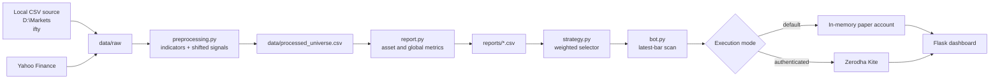

# Algo Trading Terminal — Technical Report

**Project reviewed:** `D:\Git\Algo_trading`  
**Report date:** 23 June 2026  
**Audience:** Project owner, new developers, reviewers, and operators  
**Status:** Code-based technical assessment; not an investment-performance certification

## 1. Executive summary

This project is a local, Python-based algorithmic trading terminal for Indian NSE equities. It brings five activities into one application:

1. Import daily OHLCV market data from a local directory or Yahoo Finance.
2. Calculate technical indicators and 15 rule-based trading signals.
3. backtest each signal independently for each stock.
4. Rank the strategies with a weighted score and choose one winner.
5. Scan for that winner's latest buy signals and route orders either to an in-memory paper account or Zerodha Kite.

The web dashboard is the operator interface. Flask supplies account, strategy, report, and order data to a single HTML/JavaScript page.

The project is best understood as a **research and paper-trading prototype**. Its components are sensibly separated and the signal code avoids obvious look-ahead by shifting signals one row. However, its backtest is not yet a portfolio or trade-lifecycle simulation, live broker state is not reconciled with local state, and several user-interface actions call the wrong endpoint. It should not currently be considered production-safe for unattended live trading.

The current stored report would select **RSI_Oversold**, with a selector score of approximately **64.106**. That result comes from a report generated on 17 May 2026. The underlying `data/raw` folder and `data/processed_universe.csv` are absent in the reviewed workspace, so the stored performance cannot presently be regenerated from repository-local data.

## 2. The shortest useful mental model

Think of the project as two connected systems:

- **Research pipeline:** raw CSVs → indicators → signals → consolidated dataset → backtest reports → ranked strategy.
- **Trading pipeline:** ranked strategy → latest signal scan → position sizing → paper or live order → exit sweep → dashboard state.



`main.py` orchestrates both sides and exposes them through HTTP endpoints.

## 3. Repository map

| Path | Responsibility | Reads | Writes / side effects |
|---|---|---|---|
| `main.py` | Startup, Flask application, API routes, shared dashboard state | Reports and module state | Starts local server; triggers pipelines and orders |
| `config_settings.py` | Paths, capital/risk settings, ticker universe, mutable runtime configuration | Local directories | Creates data/report directories; stores runtime credentials in memory |
| `data.py` | CSV synchronization and Yahoo Finance downloads/updates | `D:\Markets\nifty`, Yahoo Finance | `data/raw/*.csv` |
| `preprocessing.py` | Indicators, strategy signals, custom-rule evaluation, consolidation | Raw ticker CSVs | `data/processed_universe.csv` |
| `report.py` | Per-asset and global backtest analytics | Consolidated universe | Two report CSVs |
| `strategy.py` | Normalization, weighted ranking, winner selection | Global strategy report | Console output only |
| `bot.py` | Market-hours logic, paper ledger, Kite connection, orders, exits, daily scan | Raw CSVs, Kite quotes, winning strategy | Paper memory state or real broker orders |
| `templates/index.html` | Complete dashboard UI, styles, charts, API calls | Flask-injected state and JSON APIs | Sends operator commands to Flask |
| `research/reports.ipynb` | Manual inspection of generated reports | Report CSVs | Notebook outputs only |
| `research/testing_ml.ipynb` | Separate experimental XGBoost/Random Forest/LightGBM research | A legacy `final_ml_dataset.csv` path | Notebook models/plots only |
| `requirements.txt` | Runtime dependencies | — | Used by `pip` |

The ML notebook is **not connected to the running application**. It references `D:/Git/algo trading/data_strategies/final_ml_dataset.csv`, a different legacy path and schema.

## 4. End-to-end execution flow

### 4.1 Application startup

Running `main.py` performs the following:

1. Creates `data/raw` and `reports` if necessary.
2. Calls `data.download_all()`, which synchronizes CSVs from `D:\Markets\nifty` into the project without changing the source files.
3. Loads the cached global report if it exists and determines the current winner.
4. If no usable cached report exists, consolidates all local ticker files and regenerates both reports.
5. Starts Flask on `http://127.0.0.1:5000`.

Because startup accepts an existing cached report without comparing its timestamp to raw data, a stale report may remain active after data changes.

### 4.2 Data ingestion

The canonical local source is hard-coded as `D:\Markets\nifty`. Source resolution also checks legacy fallback paths. Synchronization copies files to `data/raw`, skipping existing files unless forced.

For a custom ticker, `yfinance` downloads five years of adjusted daily data. The expected normalized schema is:

| Field | Meaning |
|---|---|
| Index / Date | Trading date |
| Open | Adjusted opening price |
| High | Adjusted daily high |
| Low | Adjusted daily low |
| Close | Adjusted closing price |
| Volume | Daily traded volume |

At least 220 rows are required because the longest indicator is the 200-day EMA and later calculations also need warm-up observations.

### 4.3 Feature engineering

`engineer_technical_indicators()` produces:

- SMA 20 and 50
- EMA 9, 21, 50, and 200
- RSI 14
- MACD, signal, and histogram
- Stochastic %K and %D
- ATR 14
- Bollinger upper, middle, lower, and width
- 20-day volume average and volume z-score

Rows containing indicator warm-up `NaN` values are dropped. Each stock is processed independently and tagged with its ticker before all frames are concatenated.

### 4.4 Signal timing

Each baseline signal is calculated from a day's closing data and then shifted by one row:

```text
condition observed on day t  →  stored actionable signal on day t+1
```

This is an important anti-look-ahead measure. Custom strategy outputs are shifted in the same way. The later backtest applies the shifted signal to day `t+1`'s close-to-close return.

### 4.5 Backtest and report generation

For every strategy and ticker, `report.py` calculates:

```text
market return[t]   = Close[t] / Close[t-1] - 1
strategy return[t] = signal[t] × market return[t]
```

A `+1` signal receives the market return, a `-1` signal receives its inverse, and `0` stays in cash. Combined, long-only, and short-only statistics are computed. Results are then aggregated across assets.

Generated files:

- `reports/asset_performance_leaderboard.csv`: one row per ticker/strategy combination that emitted at least one signal.
- `reports/global_strategy_summary.csv`: one aggregate row per strategy.

Main metrics include compounded return, signal count, win rate, profit factor, average win/loss, win/loss ratio, maximum drawdown, annualized Sharpe ratio, recovery factor, and profitable-asset coverage.

The Sharpe calculation uses 252 trading days and a fixed 6% annual risk-free rate.

### 4.6 Strategy selection

`strategy.py` min-max normalizes each metric across the currently eligible strategies and assigns this score:

```text
Selection Score =
    30% × normalized profit factor
  + 25% × normalized Sharpe ratio
  + 20% × normalized profitable-asset coverage
  + 15% × inverse-normalized absolute drawdown
  + 10% × normalized average return per asset
```

The top score becomes the winner. If selection fails, the system falls back to the first enabled strategy, normally `Volatility_Breakout`.

Important interpretation: min-max scores are **relative to this exact candidate set**. Enabling or disabling one strategy can change every remaining strategy's normalized score even though no performance data changed.

### 4.7 Trading scan and execution

The dashboard scan route evaluates at most the first 60 alphabetically sorted tickers. For every latest signal equal to `+1`, it attempts a buy until ten local positions exist.

Before new entries, the bot marks open positions to market and checks:

- 5% fixed stop loss
- 15% fixed take profit
- 7% trailing stop from the highest observed price

In paper mode, orders use the latest local close plus simulated 0.07% adverse slippage. State exists only in process memory. Restarting the application resets cash, positions, and logs.

In live mode, prices and orders use Kite. The application requests CNC market orders on NSE.

## 5. Strategy catalogue

| Strategy | Signal logic | Direction / behavior |
|---|---|---|
| Volatility Breakout | Close above upper Bollinger band and volume z-score above 1.5 | Sparse long breakout |
| Golden Cross | EMA 50 crosses above EMA 200 | Sparse long regime change |
| EMA Crossover | EMA 9 crosses above EMA 21 | Sparse long momentum |
| RSI Oversold | RSI crosses upward through 30 | Sparse long mean reversion |
| RSI Overbought | RSI crosses downward through 70 | Sparse short mean reversion |
| MACD Histogram Momentum | MACD histogram crosses above zero | Sparse long momentum |
| Bollinger Mean Reversion | Prior close below lower band, current close back above it | Sparse long re-entry |
| Volume Spike | Volume exceeds 2.5 times its 20-day average | Sparse long participation signal |
| Trend Filter | Close above EMA 200 and EMA 9 above EMA 21 | Persistent `+1`; otherwise persistent `-1` |
| Turtle Breakout | Close exceeds the prior 20-day high | Sparse long breakout |
| BB Squeeze Breakout | Prior band width at 20-day minimum and close above upper band | Sparse long volatility release |
| SuperTrend Mimic | Close above prior midpoint plus 3 ATR | Sparse long impulse; not a full SuperTrend algorithm |
| Momentum 20 | 20-day return above +5% or below -5% | Persistent long/short momentum |
| EMA21 Mean Reversion | Standardized deviation from EMA 21 below -2.5 or above +2.5 | Long/short mean reversion |
| Support Bounce | Low near 50-day low and close in upper 35% of daily range | Sparse long reversal |

The live scanner buys only signals equal to `+1`. Negative signals are not used to open short positions. This means the report's combined long/short winner is not necessarily aligned with the executable long-only behavior.

## 6. Custom strategy mechanism

The dashboard can register a mathematical expression against any available dataframe column. Strategy names are sanitized; expressions are parsed into an AST and restricted to selected operators, NumPy helpers, and pandas Series methods. Evaluation occurs with empty Python built-ins.

Example conceptual rule:

```python
(RSI_14 < 35) & (Close > EMA_200) & (Volume > Volume_SMA_20)
```

The rule is validated against one sample asset, added to in-memory configuration, and then applied across the consolidated universe. Custom definitions disappear on restart because they are not persisted. A rule may also validate on the sample but fail on another asset; current processing catches the exception by returning an empty dataframe, which can silently exclude that entire ticker.

## 7. Dashboard and API

| Method | Route | Purpose |
|---|---|---|
| GET | `/` | Render terminal with initial JSON state |
| GET | `/api/state` | Refresh application, account, strategy, and report state |
| GET | `/api/get_reports` | Return global and asset report rows |
| POST | `/api/download_ticker` | Download one ticker and rebuild features/reports |
| POST | `/api/add_custom_strategy` | Validate/register rule and rebuild features/reports |
| POST | `/api/connect_zerodha` | Exchange a Kite request token for a live session |
| POST | `/api/toggle_strategy` | Change in-memory selector eligibility |
| POST | `/api/place_order` | Submit a manual buy/sell |
| POST | `/api/run_scan` | Run exits and scan up to 60 tickers |
| POST | `/api/reset_session` | Clear the in-memory paper account |

The server binds only to loopback by default, which reduces exposure. There is no authentication, authorization, or CSRF protection; changing the host to a network-accessible address would make order-capable endpoints unsafe.

## 8. Configuration and runtime state

Key defaults in `config_settings.py`:

| Setting | Current value |
|---|---:|
| Starting paper capital | ₹1,000,000 |
| Maximum local positions | 10 |
| Intended risk per trade | 1% of current cash |
| Stop loss | 5% |
| Take profit | 15% |
| Trailing stop | 7% |
| Bar interval | Daily |
| Exchange | NSE |
| Dashboard | `127.0.0.1:5000` |

Mutable state—broker credentials, enabled strategies, custom rules, positions, logs, and application status—is process-local and not durable.

The universe is the union of the configured 50-symbol list, filenames in `data/raw`, and filenames in `D:\Markets\nifty`. The comment calls this Nifty 50, but the list should not be treated as a date-versioned official index composition.

## 9. Current stored artifact snapshot

At review time:

- `data/raw` contains **0 CSV files**.
- `data/processed_universe.csv` is absent.
- `reports/global_strategy_summary.csv` exists and was last modified 17 May 2026.
- `reports/asset_performance_leaderboard.csv` exists and was last modified 17 May 2026.
- The global report has 15 strategy rows.
- Applying the current selector formula ranks `RSI_Oversold` first at about 64.106 and `Support_Bounce` second at about 61.759.
- Several stored results have extreme drawdowns: for example Momentum 20 is reported at -89.94% and Trend Filter at -93.94%.

Those results are historical artifacts, not reproducible evidence in the present checkout. The reports also contain very large “trade” counts—for example 441,732 for Trend Filter—because each active asset-day is counted as a trade.

## 10. What the performance numbers really mean

This section is crucial. The report engine is internally consistent, but some labels imply more realism than the calculation provides.

### “Trades” are active signal-days

There is no entry, holding period, exit, or round trip in `report.py`. Every non-zero signal row is counted separately. Persistent strategies therefore generate one “trade” per day per asset. Win rate and profit factor are distributions of active daily returns, not completed-trade statistics.

### No portfolio construction

Per-asset equity streams are calculated independently and then averaged. The backtest does not enforce ₹1,000,000 capital, ten position slots, position sizing, overlapping signals, or cash constraints. Its results cannot be compared directly with the paper account's portfolio value.

### No realistic execution model

The report has no commissions, STT, exchange fees, GST, stamp duty, bid/ask spread, liquidity filter, market impact, or order rejection. Signals derived from the previous close receive the next close-to-close return, which assumes exposure over that interval without explicitly specifying or pricing the entry.

### Potential survivorship and data-quality bias

The universe is based on current configuration and available files. There is no historical index membership model, delisting treatment, corporate-action audit, or validation of missing dates and zero/abnormal values.

### In-sample strategy selection

The same full history is used to measure and choose the winner. There is no train/validation/test split, walk-forward selection, parameter stability analysis, or multiple-testing correction. The winner is therefore a research hypothesis, not demonstrated out-of-sample alpha.

## 11. Risk register and known defects

### Critical before live use

1. **Live positions are not recorded locally.** A successful Kite order returns immediately without updating `positions` or cash. Exit sweeps and the ten-position limit therefore do not reflect the broker account.
2. **Live order failure silently falls through to paper execution.** An operator can receive a paper fill after a rejected live order, producing a dangerous mismatch between dashboard and broker reality.
3. **No broker reconciliation.** Orders, fills, holdings, open orders, partial fills, rejections, and externally created positions are never synchronized from Kite.
4. **Manual live orders bypass the market-hours guard.** The guard is applied in `run_daily_pipeline()`, not in `execute_order()`.
5. **The application has no durable or idempotent order state.** A restart loses local context and repeated scans can buy the same ticker again.

### High priority correctness issues

1. **ATR sizing uses the wrong column name.** The scanner requests `ATR`; preprocessing creates `ATR_14`. Position sizing therefore always takes the equal-weight fallback.
2. **Backtest and execution semantics differ.** Reports evaluate negative signals and daily persistence; the live scanner only opens long positions on `+1` and uses separate stop/target exits.
3. **Scan universe is silently capped at 60.** The dashboard passes only the first 60 sorted symbols, while reports may cover a much larger universe.
4. **Cached report freshness is not validated.** Existing reports are used even if source data is newer or absent.
5. **Selector fallback can re-enable disabled intent.** If filtering leaves no rows, scoring falls back to the unfiltered summary.
6. **Only local positions enforce capacity.** The scanner can add to an existing ticker repeatedly; position count remains unchanged.

### Dashboard defects

1. `resetSession()` calls `/api/run_scan` instead of `/api/reset_session`, so the Reset button can place orders rather than reset state.
2. `runExitSweep()` also calls the full scan endpoint, so it may create entries in addition to exits.
3. `runRecalibration()` does not invoke a recalibration endpoint; it normally only performs a state GET.
4. The recalibration ticker expression has JavaScript operator-precedence behavior that discards a typed ticker in common states.
5. The strategy leaderboard expects `Selection_Score` in the saved CSV, but that column is only added in memory by `score_strategies()`. Score bars can therefore display zero/blank.
6. The displayed maximum position count is hard-coded to 10 rather than supplied by configuration.

### Engineering and operational gaps

- No automated tests or CI configuration.
- No README, environment example, lockfile, or declared Python version.
- No structured persistent logs, database, health checks, alerts, or scheduler integration despite APScheduler being listed.
- Broad exception handling often converts data errors into empty frames, which can hide partial-universe failures.
- Data and configuration are Windows-path dependent.
- The source contains mojibake characters (`→`, `₹`, etc.), indicating an encoding mismatch that may affect UI readability.
- Flask endpoints run long recalibrations synchronously, tying up request threads.
- The global lock protects recalibration but not account/order mutations.
- Credentials are accepted through the browser and held in process memory; secrets are not masked at input/storage boundaries beyond display masking of the API key.

## 12. Recommended improvement roadmap

### Phase 1 — Make paper behavior trustworthy

1. Fix the three incorrect UI endpoint actions and add a dedicated recalibration route.
2. Change `ATR` to `ATR_14`; cap quantity by cash, slot exposure, and instrument constraints.
3. Build automated tests for indicator timing, each strategy, selector scoring, position exits, API routes, and reset behavior.
4. Persist configuration and paper state in SQLite; make scans and order requests idempotent.
5. Add data validation, freshness checks, and a pipeline manifest containing source dates, row counts, skipped tickers, code version, and report generation time.

### Phase 2 — Build a decision-grade backtest

1. Define explicit next-open or next-close execution and match it in live scanning.
2. Model position entry/exit, holding periods, capital, maximum positions, sizing, fees, spread, and slippage.
3. Compare the executable long-only strategy, not combined long/short metrics, unless short execution is implemented.
4. Add benchmark returns, exposure, turnover, CAGR, Calmar/Sortino ratios, confidence intervals, and per-period stability.
5. Use walk-forward testing with a final untouched out-of-sample interval.

### Phase 3 — Introduce a safe live broker adapter

1. Separate `PaperBroker` and `KiteBroker` behind one interface; never fall through between them after an order attempt.
2. Reconcile broker orders, trades, holdings, positions, and funds before and after every decision cycle.
3. Track order lifecycle states and partial fills with durable IDs.
4. Add kill switch, daily loss limit, per-symbol exposure, duplicate-order prevention, holiday calendar, and explicit operator confirmation for enabling live mode.
5. Make live mode fail closed when quotes, broker state, or data are unavailable.

### Phase 4 — Production operations

Add authentication, CSRF protection, secret management, migrations, structured logging, monitoring, alerting, backups, dependency pinning, CI, and a controlled deployment process. Keep the dashboard loopback-only until those controls exist.

## 13. Installation and operation

The repository expects Python packages listed in `requirements.txt`. A typical PowerShell setup is:

```powershell
py -m venv .venv
.\.venv\Scripts\Activate.ps1
python -m pip install --upgrade pip
python -m pip install -r requirements.txt
python main.py
```

Then open `http://127.0.0.1:5000`.

Before starting, either:

- place valid OHLCV CSV files in `D:\Markets\nifty`, or
- change `RAW_DATA_DIR` in `config_settings.py` to the actual source location, or
- use the custom ticker download after the server starts.

Useful component commands once Python is installed:

```powershell
python data.py             # synchronize and incrementally update local data
python preprocessing.py    # rebuild processed_universe.csv
python report.py           # rebuild both performance reports
python strategy.py         # print rankings and selected winner
python bot.py              # initialize broker/paper mode and run a limited scan
```

`bot.py` can place real orders if authentication succeeds. Use it only after the live-safety gaps in this report are addressed.

## 14. Suggested verification checklist

For each research run, record and verify:

- raw data source, earliest/latest date, ticker count, and skipped symbols;
- duplicate dates, missing OHLCV values, non-positive prices, and negative volume;
- signal on day `t` uses no information newer than the chosen execution time;
- report configuration and code commit are captured;
- results include realistic transaction costs and portfolio constraints;
- an untouched out-of-sample period remains;
- the chosen live signal and exit rules exactly match the tested rules.

For each live session, verify broker mode visibly, reconcile broker state, confirm available funds and holdings, set loss/exposure limits, test the kill switch, and require explicit confirmation before order routing is enabled.

## 15. Dependency notes

| Package | Role |
|---|---|
| pandas / NumPy | Dataframes, calculations, aggregation |
| `ta` | Technical indicators |
| yfinance | Custom downloads and incremental EOD updates |
| Flask | Local dashboard and JSON API |
| pytz | IST market-hours calculation |
| kiteconnect | Zerodha authentication, quotes, and orders |
| APScheduler | Listed but not used by current source |

The ML notebook additionally imports packages not declared in `requirements.txt`, including scikit-learn, XGBoost, LightGBM, Matplotlib, and Seaborn.

## 16. Glossary

- **OHLCV:** Open, high, low, close, and volume market data.
- **Signal:** A numeric instruction: `+1` long, `-1` short, `0` inactive.
- **ATR:** Average True Range, a volatility measure.
- **Drawdown:** Decline from a previous equity peak.
- **Profit factor:** Gross winning return divided by absolute gross losing return.
- **Sharpe ratio:** Excess return divided by return volatility, annualized here.
- **Slippage:** Difference between the observed/reference price and assumed fill price.
- **Walk-forward test:** Repeatedly train/select on past data and test only on later unseen data.
- **Reconciliation:** Matching local orders and positions to the broker's authoritative records.

## 17. Final assessment

The project has a clear educational architecture and a useful dashboard shell. Its strongest qualities are modularity, readable signal definitions, safe copying of the external data source, shifted signals, defensive metric calculations, and a paper default.

The largest conceptual gap is that the research engine, strategy selector, and execution engine do not yet describe the same trading system. The largest operational gap is that live orders are not represented by authoritative broker-synchronized state. Closing those two gaps—and fixing the dashboard endpoint mistakes—would move the code from an impressive prototype toward a system whose behavior can be measured and trusted.

